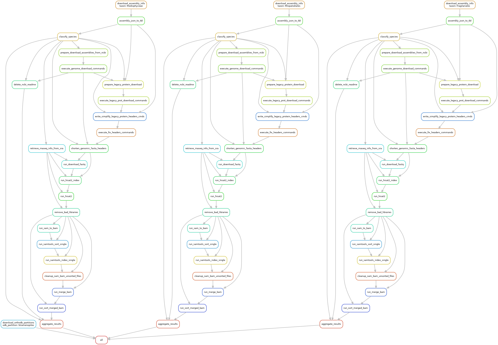

# braker-snake

Simple snakemake workflows for handling BRAKER on large data sets to prepare training data for DeepFinder. 

Ultimately it should do this:

    1. Download the available assemblies for taxa from NCBI
    2. Prioritize in case of species duplications (first choice: annotated refseq, second choice: max N50)
    3. Separate into annotated and un-annotated genomes
    4. Download the respective data sets from NCBI datasets (either genome only, or genome, annotation, proteins)
    5. Download OrthoDB partitions
    6. Check availability of RNA-Seq data for all downloaded genomes
    7. If less than N libraries, full download, alignment, sorting (N to be determined later) <- currently implemented up to here
    8. <Running VARUS appears impossible with the chdir(s)> Otherwise randomly select N libraries for download.
    9. Run BRAKER3 on the un-annotated genomes with RNA-Seq <- this will go into a separate Snakefile because it should launch one job per species, not per taxon, runtime issue otherwise
    10. Run BRAKER2 on the un-annotated genomes without RNA-Seq
    11. Run BUSCO on all the protein data sets and compile a summary

(For Clara's project, we do not need other steps, but the pipeline could serve as template for further expansion in the future.)

## Developing

First rule of development: **always commit and push your changes! Do not keep local unsynchronized changes for longer than 2 hours.**

If you want to develop on this pipeline, please at the moment, communicate with Katharina, Stepan, Clara. Many rules are still completely blank, please let the others know what rule file you are working on to avoid git conflicts.

If you want to fix a bug in an implemented set of rules, no need to communicate. Create a branch, fix the bug, make a pull request. If it has been tested properly, you can merge it yourself. Otherwise wait for Katharina to test the fix prior merging.

Once we have a running end-to-end pipeline, you can create branch for your own development. Please communicate with others to avoid conflicts down the line.

## Installation

Go do a directory where you have space for many GBs of data. Clone the repository:

```git clone https://github.com/KatharinaHoff/braker-snake.git```

Python dependencies (this workflow cannot execute with a singularity container of snakemake due to problems with SLURM communication):

```
wget https://repo.anaconda.com/miniconda/Miniconda3-latest-Linux-x86_64.sh
bash Miniconda3-latest-Linux-x86_64.sh
source ~/.bashrc # to activate miniconda
conda install -n base -c conda-forge mamba
mamba create -c conda-forge -c bioconda -n snakemake snakemake
mamba activate snakemake
pip install snakemake-executor-plugin-slurms
```

Bash dependencies (are usually available on a cluster): singularity, curl, zcat, unzip, rm, echo, mkdir, cat, sed, ...

## Configuration

### config.ini

Contents of the config.ini file are important, adjust before running! Do not set the orthodb_path into your home directory, output is huge!

### ~/profile/apptainer/config.v8+.yaml

Due to a weird binding issue with current snakemake/SLURM (see Issues), you currently have to create a config file and fill it with the bindings directory for your singularity job. I hope this will be fixed, eventually.

```
mkdir -p ~/profile/apptainer/
touch ~/profile/apptainer/config.v8+.yaml
```

Add the following content to the file (adapt to your own working directory):

```
use-singularity: True
singularity-args: "\"--bind /home/hoffk83/git/braker-snake:/home/hoffk83/git/braker-snake --bind /home/hoffk83/ncbi:/home/hoffk83/ncbi\""
```

### ~/.ncbi/user-settings.mkfg

This config with contents must be present to avoid huge caching files when VARUS runs fastq-dump:

```
mkdir -p ~/.ncbi
echo '/repository/user/cache-disabled = "true"' >> ~/.ncbi/user-settings.mkfg
```

## Input data

The input data is expected to be in the following format:

```
<taxon> <odb_partition>
```

You find a small example in input.csv.  You may want to modify input.csv

**Warning:** specifying a taxon that includes another taxon in the input is dangerous! We are not checking for species duplicates across taxa. Don't do this!

The first workflow, `Snakefile_dataprep` will run all expensive tasks for one taxon in a loop on node. This means if you provide a taxon with extremely many species/genomes to process, this may lead to exceeding the runtime limit of the BRAIN. For example 7 libraries for a single species take ~3 hours for fasterq-dump and gzipping. This means, if you set the threshold to dowload at most 10 libs per species, and if every species in the taxon has RNA-Seq, then a taxon should have at most 16 species in order to have a good chance that the job will not die due to the runtime limit.

## Running

Execute this only in a place where you have space for many GBs of data, output is written to a subdirectory data and will be very, very big!

Run the pipeline (on login-a or login-b):

```
mamba activate snakemake
module load singularity
cd braker-snake
snakemake -s Snakefile_dataprep --executor slurm --default-resources slurm_account=none slurm_partition=batch --jobs=100 --use-apptainer
```

The pipeline automatically submits some tasks via SLURM.

### Known issues

Everything that relies on download from the web is fragile. For example, the error message `panic: runtime error: invalid memory address or nil pointer dereference` can happen when a ncbi datasets genome data download fails. Simply restart the workflow. It will automatically try to fix it.

Currently, there seems to be a hisat2 problem that I still have to fix.

## Current DAG with example data

(can always be generated with `snakemake -s Snakefile_dataprep --dag | dot -Tpng > dag.png`, potentially not on BRAIN because dot may not be installed)

